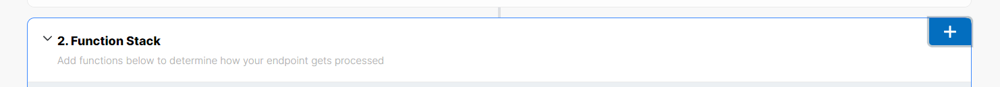
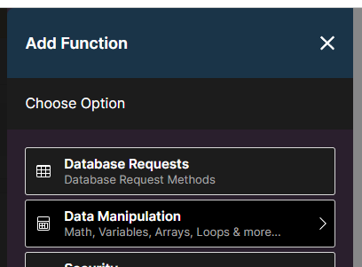
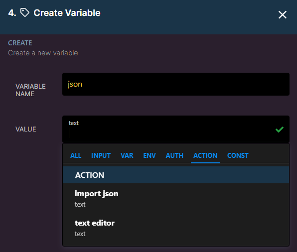
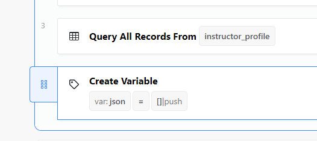
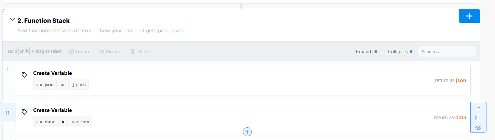
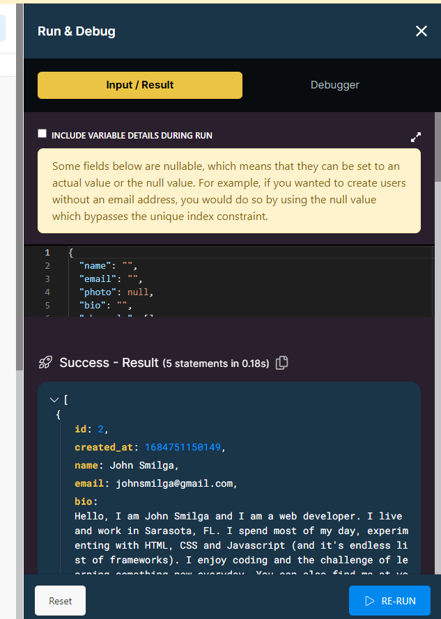

## How to run

1. Downlaod this repository
2. Extract the downloaded ZIP file if you chose the "Download ZIP" option.
3. Open a terminal or command prompt and navigate to the downloaded repository's directory.
4. Ensure you have Node.js installed on your computer. You can check this by running the command node --version in the terminal. If Node.js is not installed, download and install it from the official Node.js website.
5. Paste the JSON data to `sample.json`
6. Run the script.js file using the Node.js command. In the terminal, enter `node script.js`. This will execute the script and generate a data.json file based on the logic defined in script.js.
7. After the script has finished running, you should find the `data.json` file generated in the same directory as the script.js file.

 

> _These steps are important so that the channels field is in the right format and the bio doesn't contain the html tags. This will also remove duplicate data._

 
 

## Uploading to Xano

1. Go to this [Xano api endpoint](https://x8ki-letl-twmt.n7.xano.io/admin/workspace/35925-0/api/105602/query/1075336)
2. Click the create variable step 1 `var:json` in the function stack and delete it
3. Click the add button on the function stack, click data manipulation then add variable.

   
   

4. Input `json` as variable name and then for the value, click action and import json.

   

5. Paste the `data.json` from [**How to run step 6**](#how-to-run)
6. Hover the created variable til the left icon shows and drag it all the way to step 1

   
   

7. Click the create variable `var:data` on step 2 of function stack. On the value, click VAR and choose the `json` var.

   

8. Click `Run & Debug` on the upper right side and then click `Run`. This will upload the json to the database.

   
